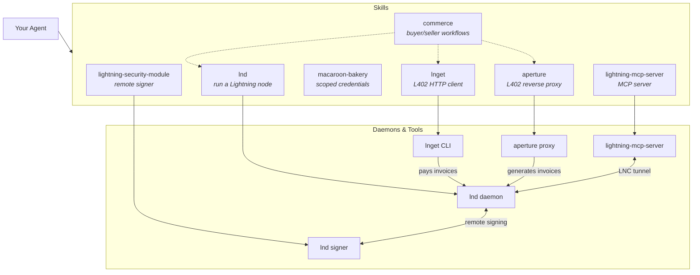
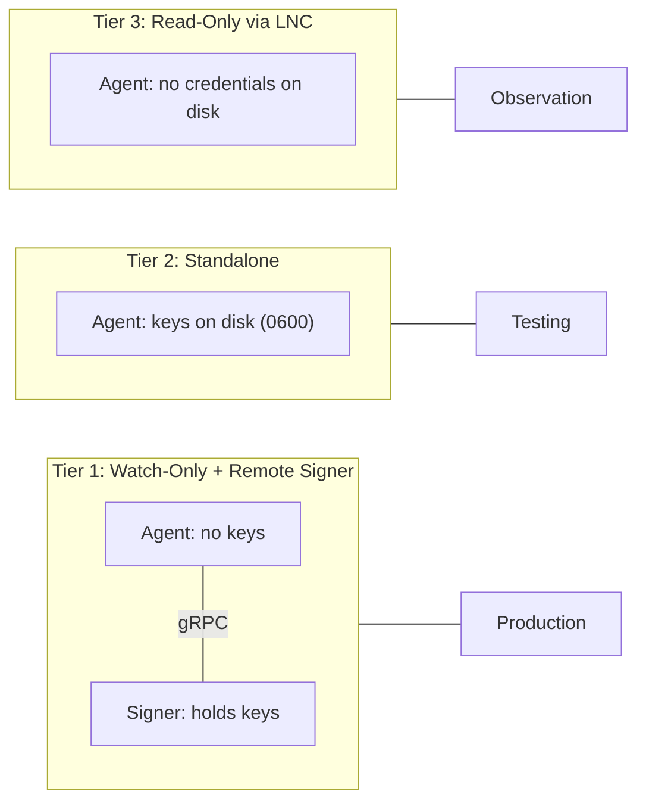

# Lightning Agent Tools

AI agents can read documentation, write code, and orchestrate complex workflows,
but they can't easily pay for things. Traditional payment rails require
government IDs, bank accounts, and manual enrollment, none of which work for
autonomous software. Lightning Agent Tools bridges this gap by giving agents
native access to the [Lightning Network](https://lightning.network), a
decentralized payment protocol capable of instant, high-volume transactions with
no identity requirements.

The toolkit consists of seven composable skills and an MCP server. Together they
let an agent run a Lightning node, pay for resources on the web using the
[L402](https://docs.lightning.engineering/the-lightning-network/l402) protocol,
host its own paid API endpoints, manage scoped credentials, and query node state
through the Model Context Protocol. The skills work with any agent framework
that can execute shell commands: [Claude Code](https://docs.anthropic.com/en/docs/agents-and-tools/claude-code/overview),
[Codex](https://openai.com/index/codex/), or your own tooling. The MCP server
follows the [Model Context Protocol](https://modelcontextprotocol.io) standard
and works with any compatible client. The security model defaults to a remote
signer architecture that keeps private keys on a separate machine, away from the
agent's runtime environment.

## Install

**MCP server** (zero-install, any MCP client):

```bash
claude mcp add --transport stdio lnc -- npx -y @lightninglabs/lightning-mcp-server
```

**Full plugin** (all 7 skills via Claude Code):

```bash
claude plugin marketplace add lightninglabs/lightning-agent-tools
claude plugin install lightning-agent-tools@lightninglabs
```

**From source** (requires Go 1.24+):

```bash
git clone https://github.com/lightninglabs/lightning-agent-tools.git
cd lightning-agent-tools
skills/lightning-mcp-server/scripts/install.sh
skills/lightning-mcp-server/scripts/configure.sh --production
skills/lightning-mcp-server/scripts/setup-claude-config.sh --scope project
```

See [Quick Start](#quick-start) below for detailed setup options including
environment variables, regtest mode, and the full commerce stack.

## How It Works



The skills break down into three functional groups:

**Payment infrastructure.** The `lnd` skill runs a Lightning node using the
Neutrino light client (no full Bitcoin node required) with SQLite storage. The
`lightning-security-module` sets up a remote signer to hold private keys on a
separate machine. The `macaroon-bakery` bakes least-privilege credentials so
agents only get the permissions they need.

**Commerce.** The `lnget` skill installs a command-line HTTP client that handles
L402 payments automatically. When it hits a 402 response, it pays the embedded
Lightning invoice, caches the token, and retries. The `aperture` skill runs an
L402 reverse proxy that gates access to a backend service behind Lightning
invoices. The `commerce` skill ties these together into buyer and seller
workflows.

**Node access.** The `lightning-mcp-server` skill builds and configures an MCP server that
connects to a Lightning node via Lightning Node Connect (encrypted WebSocket
tunnels, pairing-phrase auth, no stored credentials). It exposes 18 read-only
tools for querying node state and works with any MCP-compatible client.

## Quick Start

### Option A: Zero-Install MCP via `claude mcp add`

Register the MCP server with Claude Code in one command — no Go toolchain or
git clone required:

```bash
claude mcp add --transport stdio lnc -- npx -y @lightninglabs/lightning-mcp-server
```

With a specific mailbox server:

```bash
claude mcp add --transport stdio \
  --env LNC_MAILBOX_SERVER=mailbox.terminal.lightning.today:443 \
  lnc -- npx -y @lightninglabs/lightning-mcp-server
```

For development/regtest:

```bash
claude mcp add --transport stdio \
  --env LNC_MAILBOX_SERVER=localhost:11110 \
  --env LNC_DEV_MODE=true \
  --env LNC_INSECURE=true \
  lnc -- npx -y @lightninglabs/lightning-mcp-server
```

Scope options: `--scope local` (default, just you), `--scope project` (shared
via `.mcp.json`), `--scope user` (all your projects).

Restart Claude Code, then:

```
Connect to my Lightning node with pairing phrase: "word1 word2 ... word10"
```

The agent can now query balances, list channels, decode invoices, and inspect
the network graph. See [MCP Server](docs/mcp-server.md) for details.

### Option B: Full Plugin with All Skills

Install the complete plugin (all 7 skills + MCP server) via the Claude Code
plugin marketplace:

```bash
# Add the marketplace (one-time)
claude plugin marketplace add lightninglabs/lightning-agent-tools

# Install the plugin (gets all skills)
claude plugin install lightning-agent-tools@lightninglabs
```

Or load locally for development:

```bash
git clone https://github.com/lightninglabs/lightning-agent-tools.git
claude --plugin-dir ./lightning-agent-tools
```

This gives Claude Code access to all skills: lnd node management, remote
signer security, lnget L402 payments, Aperture proxy, macaroon bakery,
MCP server integration, and commerce workflows.

### Option C: Read-Only Node Access (from source)

Build the MCP server from source. Requires Go 1.24+.

```bash
git clone https://github.com/lightninglabs/lightning-agent-tools.git
cd lightning-agent-tools

skills/lightning-mcp-server/scripts/install.sh
skills/lightning-mcp-server/scripts/configure.sh --production
skills/lightning-mcp-server/scripts/setup-claude-config.sh --scope project
```

Restart Claude Code, then:

```
Connect to my Lightning node with pairing phrase: "word1 word2 ... word10"
```

The agent can now query balances, list channels, decode invoices, and inspect
the network graph. See [MCP Server](docs/mcp-server.md) for details.

### Option D: Full Commerce Stack

Run your own node and start buying or selling resources over Lightning. Docker
is the default deployment method — `install.sh` pulls a container image and
`start-lnd.sh` launches it via Docker Compose.

```bash
git clone https://github.com/lightninglabs/lightning-agent-tools.git
cd lightning-agent-tools

# Install components (pulls Docker images by default; --source to build natively)
skills/lnd/scripts/install.sh
skills/lnget/scripts/install.sh

# Create and start a node (runs in a Docker container)
skills/lnd/scripts/create-wallet.sh --mode standalone
skills/lnd/scripts/start-lnd.sh

# Configure lnget
lnget config init

# Fetch a paid resource
lnget --max-cost 500 https://api.example.com/data.json
```

All wrapper scripts (`start-lnd.sh`, `stop-lnd.sh`, `lncli.sh`) auto-detect
Docker containers. Pass `--native` to any script to use a locally built binary
instead.

For the full walkthrough including wallet funding, channel management, and
hosting your own paid endpoints, see [Commerce](docs/commerce.md).

### Natural Language

Agents with skill discovery (like Claude Code) pick up the skills automatically.
You can interact through natural language:

```
Install Lightning Agent Tools and set up a Lightning node with
remote signer so I can start paying for L402 APIs with lnget.
```

```
Bake a pay-only macaroon on my regtest node
```

```
Export credentials from my signer and set up a watch-only node
```

## Skills

| Skill | What it does |
|-------|-------------|
| **lnd** | Installs and operates an lnd Lightning node. Neutrino light client, SQLite storage. Defaults to watch-only mode with remote signer. |
| **lightning-security-module** | Sets up a remote signer node on a separate machine. Holds all private keys; the agent machine has none. |
| **macaroon-bakery** | Bakes scoped macaroons (pay-only, invoice-only, read-only, channel-admin, signer-only) for least-privilege access. |
| **lnget** | Command-line HTTP client with automatic L402 payment. Pays Lightning invoices on 402 responses, caches tokens, retries. |
| **aperture** | L402 reverse proxy. Sits in front of a backend service, issues invoices, validates paid tokens, proxies authorized requests. |
| **lightning-mcp-server** | Builds and configures the MCP server for LNC-based read-only access plus daemon-gated node-ops requests. 24 tools, no stored credentials. |
| **commerce** | Meta-skill orchestrating lnd + lnget + aperture for end-to-end buyer/seller workflows. |

All scripts support `--container` for Docker-based lnd nodes and `--rpcserver`
/ `--tlscertpath` / `--macaroonpath` for remote nodes.

## Security

The kit provides three tiers of access with increasing trust requirements:



**Tier 1 (default)** splits the node into a watch-only instance on the agent
machine and a signer on a separate machine. The agent can route payments and
manage channels but cannot sign transactions. Keys never leave the signer.

**Tier 2** stores keys locally. Appropriate for testnet, regtest, and small-value
mainnet experiments.

**Tier 3** uses the MCP server with LNC. No credentials are written to disk;
the pairing phrase is handled in memory and ephemeral ECDSA keypairs are
generated per session.

For all tiers, use the `macaroon-bakery` to scope credentials. A buyer agent
gets a `pay-only` macaroon; a monitoring agent gets `read-only`. Never hand out
`admin.macaroon` in production.

See [Security](docs/security.md) for threat models, hardening, and the
production checklist.

## Documentation

| Document | Description |
|----------|-------------|
| [Architecture](docs/architecture.md) | System design, component map, plugin discovery, data flows |
| [Security](docs/security.md) | Three-tier security model, remote signer, macaroon scoping, production checklist |
| [L402 and lnget](docs/l402-and-lnget.md) | The L402 protocol, lnget usage, spending controls, token caching |
| [MCP Server](docs/mcp-server.md) | LNC mechanics, setup walkthrough, 18-tool reference, configuration |
| [Commerce](docs/commerce.md) | Buyer and seller agent setup, the commerce loop, cost management |
| [Two-Agent Setup](docs/two-agent-setup.md) | Signer agent + node agent walkthrough for production key isolation |
| [Quick Reference](docs/quickref.md) | Every command in one place |

Each skill also has a detailed `SKILL.md` in its directory under `skills/` with
operational reference material: script options, configuration templates, file
paths, and troubleshooting.

## Prerequisites

- **Docker** for running lnd/litd containers (the default deployment method)
- **Go 1.21+** only needed when building from source (`install.sh --source`) or
  for lnget and the MCP server
- **jq** for JSON processing in shell scripts
- **Lightning Terminal** (optional) for generating LNC pairing phrases

Container image versions are pinned in `versions.env` at the repository root and
can be overridden via environment variables.

## License

See [LICENSE](lightning-mcp-server/LICENSE).
