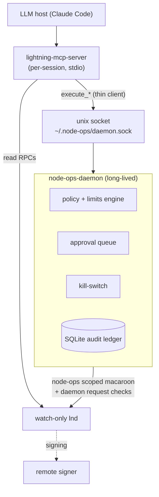

# ADR-0001 — Governance daemon for bounded node-ops execution

- **Status:** Proposed
- **Date:** 2026-06-25
- **Issue:** #2 (blocks #8, #9, #10, #11, #12)

## Context

The node-ops thesis is **bounded execution**: every existing tool is either
*safe-but-inert* (this kit's MCP server — read-only) or *active-but-unbounded*
(abacus/LNDg/bos — admin macaroon, caps hardcoded in tool code, no audit, leaky or
absent approval gates). Our wedge is the missing middle: an agent that can *act* on
the node, but only inside cryptographically- and policy-bounded authority, with a
real approval gate and an append-only audit trail.

A hard constraint falls out of that: **enforcement must live below the LLM and
outside any single agent turn.** The existing `lightning-mcp-server` is the wrong
home for it — it is a **per-session, stdio subprocess** spawned by an MCP host
(Claude Code). It has no persistent lifetime, so it cannot own a cumulative spend
budget, a cooldown clock, a durable audit ledger, or a kill-switch that must stay
effective even when no agent is connected. A prompt or an Agent Skill is weaker
still (`allowed-tools` is advisory, not a security boundary).

So we need a component that (a) outlives any MCP session, (b) is the *only* holder
of write authority, and (c) enforces limits in code regardless of what the model
asks.

## Decision

Add a long-lived **`node-ops-daemon`** (new Go binary) as the single enforcement
boundary for all node-ops writes. The read-only MCP server is unchanged; new
**write** MCP tools are thin clients that delegate to the daemon.



### Sub-decisions

1. **Placement — sidecar daemon, not in-process.** A separate process that runs
   under systemd, independent of any MCP session. *Rejected:* an in-process package
   in the MCP server (dies with the session; can't keep cumulative budgets, a
   cooldown clock, or a kill-switch alive between connections).

2. **Language — Go.** Matches the existing `lightning-mcp-server` module; reuses its
   `lnrpc`/`routerrpc` client code and the macaroon-bakery output; one toolchain.

3. **Transport — Unix-domain sockets.** MCP write clients use
   `~/.node-ops/daemon.sock` (mode `0600`) with length-prefixed JSON
   request/response (gRPC is an acceptable later swap). Operator approvals use a
   separate operator-only socket/credential boundary. Local only — never a TCP port.
   The MCP write tool sends `{action, params}`; the daemon returns
   `{status, request_id, result|reason}`.

4. **The daemon is the only holder of write authority.** It loads the **`node-ops`
   scoped macaroon** (issue #7 — `UpdateChannelPolicy` + the minimum router RPCs
   needed for circular rebalances, *not* admin) and the watch-only node connection.
   lnd's URI-scoped macaroons do **not** encode "self-pay only"; self-payment is a
   daemon-enforced request invariant before any router RPC is called. The MCP server
   and the agent never see a write-capable credential.

5. **Config — TOML** at `~/.node-ops/config.toml`. Limits are enforced from this
   file in code, not from the prompt:

   ```toml
   [node]
   lnd_rpc      = "127.0.0.1:10009"
   macaroon     = "~/.node-ops/node-ops.macaroon"   # scoped, from issue #7
   tls_cert     = "~/.lnd/tls.cert"

   [limits]                      # enforced at the execution boundary
   daily_rebalance_budget_sat = 100000
   max_fee_ppm_delta          = 100      # per single fee change
   per_channel_cooldown       = "30m"
   rebalance_max_fee_ppm      = 500

   [approval]                    # gate covers ALL money-affecting actions
   auto_execute_below_ppm_delta = 25     # <= this auto-executes within limits…
   require_approval             = true   # …everything else queues for a human

   [storage]
   ledger = "~/.node-ops/ledger.db"              # SQLite
   limits_state = "~/.node-ops/limits-state.json" # budgets/cooldowns
   killswitch = "~/.node-ops/STOP"               # presence halts all execution

   [operator]
   approval_socket = "~/.node-ops/operator.sock"  # separate human/operator boundary
   approval_token_file = "~/.node-ops/operator.token"
   ```

6. **Ledger — SQLite** (`modernc.org/sqlite`, pure-Go, no CGO), an **INSERT-only**
   `actions` table (proposal, triggering signal, justification, approve/deny, result,
   timestamps). *Rejected:* append-only JSONL — harder to query for the audit query
   tool (#12); SQLite gives transactional durability **and** queryability in one file.

7. **Approval — a pending queue, not a blocking prompt.** A money-affecting request
   above the auto-execute threshold is persisted as `pending` and surfaced
   conversationally; a human approves out-of-band through an operator-only surface
   such as `node-ops approve <request_id>`. The daemon authenticates approvals on a
   boundary unavailable to the MCP host/agent, for example a separate Unix socket
   guarded by peer credentials for an operator UID/group, or an equivalent
   human-only credential. Approval is never exposed through the same model-callable
   MCP session or the same execution socket as write requests. **All**
   money-affecting actions pass the gate — closing the ungated-fee-set hole in
   abacus/LNDg.

8. **Kill-switch — independent of any LLM turn.** Presence of the `killswitch` file
   (or a `--stop` daemon flag) makes the daemon reject every execution request
   immediately, regardless of limits or approvals. `node-ops stop` / `node-ops resume`
   toggle it.

## Consequences

**Positive**
- Enforcement (budgets, cooldowns, kill-switch, audit) survives across sessions and
  reboots — it is not tied to an agent turn.
- A single, queryable source of truth for "what did the agent do and why" (#12).
- Write authority is physically isolated: scoped macaroon lives only in the daemon;
  combined with the remote signer, a compromised agent box still cannot move funds.

**Negative / costs**
- An extra long-lived process to supervise (a `node-ops-daemon.service` systemd unit
  is part of #8).
- IPC surfaces (execution + operator approval) to design and secure (`0600`,
  peer-cred check, separate operator boundary).
- Daemon lifecycle/versioning must stay in lockstep with the MCP write-tool client.

**Unlocks**
- #7 scoped macaroon → consumed by the daemon.
- #8 daemon skeleton (limits + approval queue + ledger + kill-switch) implements this ADR.
- #9 `execute_fee_set`, #10 `execute_rebalance` → thin MCP clients over the socket.
- #11 limits hardening, #12 daemon/MCP ledger query tool.

## Alternatives considered

| Option | Verdict | Why |
|--------|---------|-----|
| In-process limits in the MCP server | Rejected | Per-session stdio process; can't own persistent budgets/cooldown/kill-switch/audit. |
| Enforcement in the Agent Skill / prompt | Rejected | A skill/prompt can't *enforce* anything; `allowed-tools` is advisory. Defeats the whole wedge. |
| Append-only JSONL ledger | Rejected | Not queryable enough for #12; SQLite gives durability **and** queries in one file. |
| TCP/gRPC over localhost now | Deferred | Unix socket is simpler and avoids any port exposure; gRPC can swap in later behind the same client interface. |

Closes #2.
