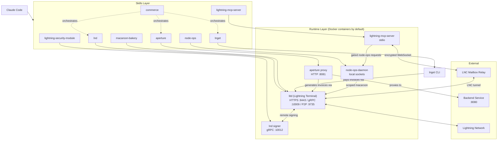
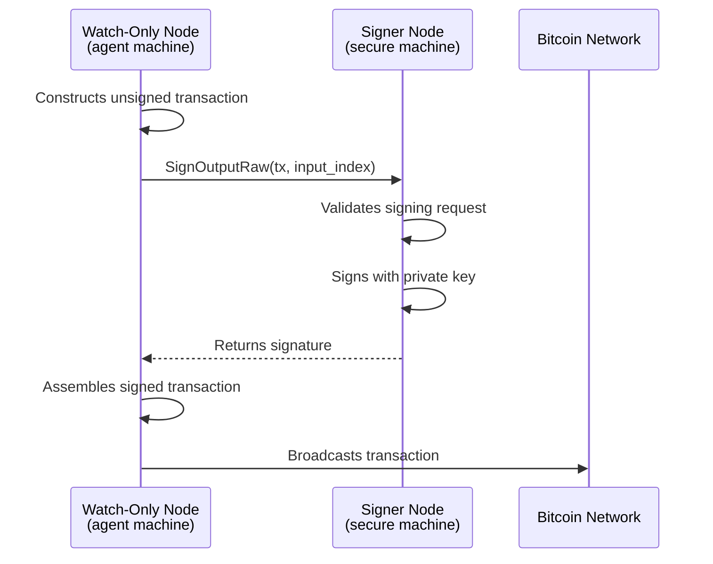
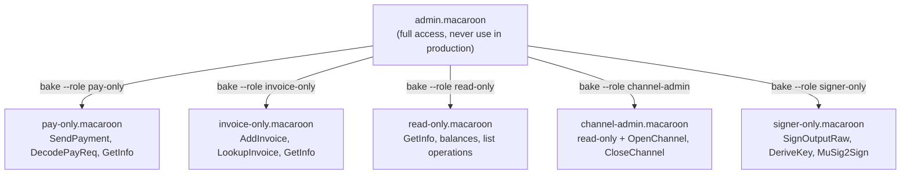
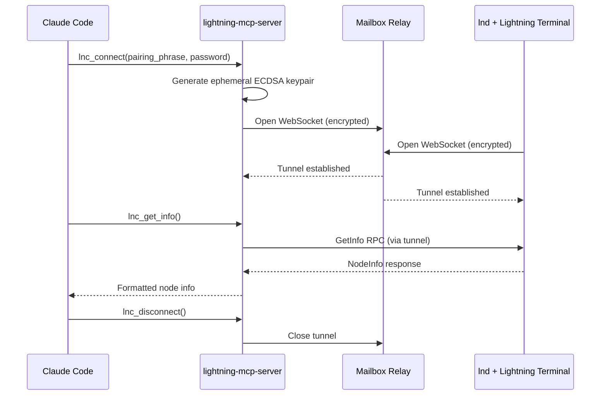
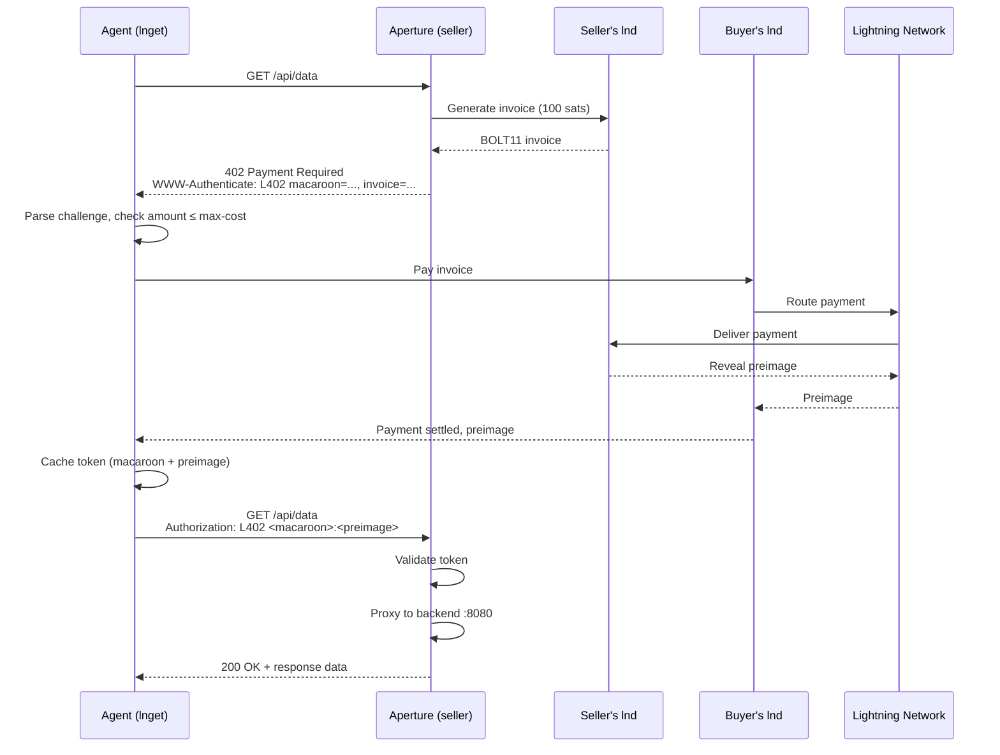

# Architecture

> How Lightning Agent Tools is structured and how its components interact.

Lightning Agent Tools is composed of eight skills and an MCP server. Each skill
manages a distinct piece of Lightning infrastructure (running a node, baking
credentials, fetching paid content, hosting paid endpoints, or routing bounded
node-ops approvals) and they compose together to give agents a full-stack
payment capability. The skills are shell scripts and documentation that work
with any agent framework capable of executing commands (Claude Code, Codex, or
custom tooling). The MCP server follows the Model Context Protocol standard and
works with any compatible client. This document explains how the pieces fit
together.

## Component Overview

The kit has three layers: the Claude Code plugin interface, the skills that
manage infrastructure, and the daemons and tools those skills operate.



The runtime layer runs inside Docker containers by default. The primary
container runs [litd](https://github.com/lightninglabs/lightning-terminal)
(Lightning Terminal), which bundles lnd, Loop, Pool, Taproot Assets (tapd), and
Faraday into a single process. The signer runs plain lnd in a separate
container. All container images are pinned in `versions.env`.

The `commerce` skill is a meta-skill. It doesn't manage any infrastructure
directly but orchestrates `lnd`, `lnget`, and `aperture` together into buyer
and seller workflows.

The `node-ops` skill is the operator playbook for bounded fee-set and circular
rebalance workflows. It uses the local `node-ops-daemon` boundary so the MCP
server can submit requests without receiving LND write credentials; the daemon
holds the scoped macaroon, enforces limits, requires operator approval, and
writes the audit ledger.

## Plugin Discovery

The kit ships as a Claude Code plugin but the underlying skills are
framework-agnostic shell scripts. Any agent that can run bash commands can use
them directly.

For Claude Code, discovery happens through two mechanisms:

**Plugin manifest.** The `.claude-plugin/plugin.json` file declares the plugin
identity (name, version, author). Claude Code reads this when loading the
project.

**Skill symlinks.** The `.claude/skills/` directory contains symlinks pointing
to each skill's directory under `skills/`:

```
.claude/skills/
├── aperture → ../../skills/aperture
├── commerce → ../../skills/commerce
├── lightning-security-module → ../../skills/lightning-security-module
├── lnd → ../../skills/lnd
├── lnget → ../../skills/lnget
├── macaroon-bakery → ../../skills/macaroon-bakery
├── lightning-mcp-server → ../../skills/lightning-mcp-server
└── node-ops → ../../skills/node-ops
```

Each skill directory contains a `SKILL.md` file with YAML frontmatter declaring
the skill's name, description, and whether it can be invoked directly by users.
The skill's content (shell scripts, templates, reference docs) lives
alongside it. In Claude Code, `SKILL.md` is injected into the agent's context
when the skill is activated. In other frameworks, agents can read the `SKILL.md`
directly and execute the shell scripts it references.

## The Lightning Node

The `lnd` skill manages a
[litd](https://github.com/lightninglabs/lightning-terminal) (Lightning Terminal)
instance, which bundles lnd with Loop, Pool, Taproot Assets, and Faraday in a
single daemon. litd serves as the foundation for everything else in the kit. The
node uses two lightweight backends to avoid requiring a full Bitcoin node:

- **Neutrino** (BIP 157/158) for chain data. Fetches compact block filters
  from a set of btcd peers rather than downloading the full blockchain.
  (Regtest mode uses a Bitcoin Core container instead.)
- **SQLite** for local storage. All channel state, invoices, and routing data
  live in a single SQLite database rather than the default bbolt.

### Container-First Deployment

The default deployment runs litd inside a Docker container. The install script
(`skills/lnd/scripts/install.sh`) pulls the
`lightninglabs/lightning-terminal` image from Docker Hub. Image versions are
pinned in `versions.env` at the repo root and can be overridden at runtime via
environment variables.

For native builds, pass `--source` to `install.sh`, which builds lnd from source
with the required build tags: `signrpc walletrpc chainrpc invoicesrpc routerrpc
peersrpc kvdb_sqlite neutrinorpc`.

### Configuration

The kit uses a config-file-driven approach. Config templates live in
`skills/lnd/templates/` and are processed at container startup by
`skills/lib/config-gen.sh`, which substitutes the network, debug level, node
alias, UI password, and any extra arguments. The generated config is
bind-mounted into the container as a read-only file. This avoids the fragility
of long `docker run` command-line flag lists.

Three Docker Compose files define the container topology for each mode:

| File | Mode | Containers |
|------|------|-----------|
| `docker-compose.yml` | Standalone | litd (neutrino) |
| `docker-compose-regtest.yml` | Regtest | litd + Bitcoin Core (+ optional litd-bob) |
| `docker-compose-watchonly.yml` | Watch-only | litd + signer lnd |

### Profiles

Profile files in `skills/lnd/profiles/` let you customize behavior without
editing templates. Each profile is a `.env` file that sets `LND_DEBUG`,
`LITD_EXTRA_ARGS`, and optionally `LITD_ALIAS`. Available profiles:

| Profile | Purpose |
|---------|---------|
| `default.env` | Standard operation (info-level logging) |
| `debug.env` | Verbose per-subsystem tracing |
| `regtest.env` | Local development on regtest |
| `taproot.env` | Enables simple taproot channels |
| `wumbo.env` | Large channels up to 10 BTC |

Start with a profile: `skills/lnd/scripts/start-lnd.sh --profile debug`

### Native Mode

All wrapper scripts (`start-lnd.sh`, `stop-lnd.sh`, `lncli.sh`) accept a
`--native` flag to bypass Docker and use a locally installed lnd binary. In
native mode, the config template at `skills/lnd/templates/lnd.conf.template`
is deployed to `~/.lnget/lnd/lnd.conf`.

### Watch-Only vs Standalone

The node operates in one of two modes:

**Watch-only (default).** The node has no private keys. It imports account xpubs
from a remote signer and delegates all signing operations over gRPC. This is the
production configuration. Even if the agent's machine is compromised, an
attacker cannot sign transactions or extract keys because they don't exist on
that machine.

**Standalone.** The node generates and stores its own seed locally. The 24-word
mnemonic is written to `~/.lnget/lnd/seed.txt` with mode 0600. This mode is
appropriate for testnet, regtest, and development. It should not be used with
significant funds.

The mode is selected at wallet creation time via the `--mode` flag on
`create-wallet.sh`. Once a wallet is created in one mode, the choice is
permanent for that data directory.

## Remote Signer

The `lightning-security-module` skill sets up a second lnd instance that exists
solely to hold private keys and sign transactions. This signer node never
connects to the Lightning Network's peer-to-peer layer, never routes payments,
and never opens channels. Its only network exposure is a gRPC interface on port
10012 that the watch-only node connects to for signing requests.

By default, the signer runs in a Docker container named `litd-signer`, defined
in `skills/lightning-security-module/templates/docker-compose-signer.yml`. The
`setup-signer.sh` script auto-detects a running `litd-signer` container and
routes wallet creation and credential export through it. Pass `--native` to
use a locally installed lnd binary instead.



The signer exports a **credentials bundle** containing three files:

| File | Purpose |
|------|---------|
| `accounts.json` | Account xpubs for watch-only wallet import |
| `tls.cert` | TLS certificate for authenticated gRPC |
| `admin.macaroon` | RPC authentication token (scope down for production) |

The bundle is generated by `setup-signer.sh` and written to
`~/.lnget/signer/credentials-bundle/`. A base64-encoded tarball
(`credentials-bundle.tar.gz.b64`) is also created for easy transfer to the
agent machine. On the agent side, `import-credentials.sh` unpacks the bundle
into `~/.lnget/lnd/signer-credentials/`.

The signer's config (`skills/lightning-security-module/templates/signer-lnd.conf.template`)
differs from a standard lnd config in important ways: it listens for RPC on
`0.0.0.0:10012` to accept connections from the watch-only node, binds REST to
`0.0.0.0:10013` (container mode needs this for host connectivity; native mode
rebinds to `localhost`), includes container hostnames (`signer`, `litd-signer`)
in the TLS certificate's extra domains, and disables all routing and autopilot
features.

For a full discussion of threat models and hardening, see
[Security](security.md).

## Credentials

lnd uses [macaroons](https://research.google/pubs/pub41892/) for RPC
authentication. A macaroon is a bearer token: anyone who possesses it can
exercise the permissions it encodes. The default `admin.macaroon` grants
unrestricted access to every RPC method, which is why you should never hand it
to an agent in production.

The `macaroon-bakery` skill bakes scoped macaroons that grant only the
permissions an agent needs. It ships with five preset roles:

| Role | Can do | Cannot do |
|------|--------|-----------|
| `pay-only` | Pay and decode invoices | Create invoices, manage channels |
| `invoice-only` | Create and look up invoices | Pay, manage channels |
| `read-only` | Query balances, channels, peers, payments | Modify any state |
| `channel-admin` | Everything in read-only + open/close channels | Pay or create invoices |
| `signer-only` | Sign transactions, derive keys | Everything else |

Custom macaroons can be baked with arbitrary permission sets by passing
individual URI permissions to `bake.sh --custom`. The full list of available
permissions is available via `bake.sh --list-permissions`.

Macaroons are baked by the lnd node itself. The bakery script calls `lncli
bakemacaroon` with the appropriate permission URIs. The resulting macaroon file
should be stored with mode 0600 and treated like a password.



## MCP Server

The MCP server (`lightning-mcp-server/`) connects AI assistants to a Lightning node
through the [Model Context Protocol](https://modelcontextprotocol.io). It uses
[Lightning Node Connect](https://docs.lightning.engineering/lightning-network-tools/lightning-terminal/lightning-node-connect)
(LNC) to reach the node, which means the assistant never needs direct network
access, TLS certificates, or macaroon files.

LNC works by establishing an end-to-end encrypted WebSocket tunnel through a
mailbox relay server. The agent and the lnd node each connect outbound to the
mailbox. Neither needs to accept inbound connections. The tunnel is
authenticated by a 10-word pairing phrase generated in Lightning Terminal.



The server runs on stdio transport. The MCP client (Claude Code or any other
MCP-compatible host) launches it as a subprocess and communicates over
stdin/stdout. No HTTP server, no port binding. The server's Go implementation
lives under `lightning-mcp-server/` and is built via
`skills/lightning-mcp-server/scripts/install.sh`.

The server exposes LNC-backed read tools organized into categories such as
Connection, Node, Channels, Invoices, Payments, Peers/Network, and On-Chain.
Those tools query balances, list channels, decode invoices, and inspect the
network graph without modifying node state. Daemon-gated node-ops tools are
separate local socket clients; see [MCP Server](mcp-server.md) for the full tool
reference.

Internally, the server uses a service manager
(`lightning-mcp-server/internal/services/manager.go`) that initializes one service per
tool category and registers their tools with the MCP SDK. When `lnc_connect`
is called, the manager creates a Lightning client via LNC and distributes it to
all services. When `lnc_disconnect` is called, the connection is closed and the
ephemeral keypair is discarded.

## L402 Commerce Flow

The L402 protocol ties the system together for commerce. When an agent uses
`lnget` to fetch a resource protected by `aperture`, the following exchange
happens:



`lnget` handles this entire flow automatically. The agent runs a single command
(`lnget https://api.example.com/data`) and receives the response data. The 402
challenge, invoice payment, token caching, and authenticated retry happen
transparently. Cached tokens are reused for subsequent requests to the same
domain, avoiding repeat payments.

On the server side, `aperture` sits in front of a backend HTTP service and
intercepts requests to protected paths. It generates invoices through its
connected lnd node, issues L402 challenges to unauthenticated requests, and
validates paid tokens on retry. The backend service doesn't need to know
anything about Lightning or L402.

For the full protocol specification and client/server setup, see
[L402 and lnget](l402-and-lnget.md) and [Commerce](commerce.md).

## File System Layout

All kit components store their data under predictable paths. The `~/.lnget/`
tree is managed by the kit's scripts; `~/.lnd/` and `~/.aperture/` are
managed by their respective daemons.

### Host Files (managed by kit scripts)

| Path | Owner | Contents |
|------|-------|----------|
| `~/.lnget/lnd/wallet-password.txt` | lnd skill | Wallet unlock passphrase (0600) |
| `~/.lnget/lnd/seed.txt` | lnd skill | 24-word mnemonic, standalone only (0600) |
| `~/.lnget/lnd/signer-credentials/` | lnd skill | Imported signer bundle (watch-only) |
| `~/.lnget/signer/signer-lnd.conf` | security module | Signer node configuration |
| `~/.lnget/signer/wallet-password.txt` | security module | Signer passphrase (0600) |
| `~/.lnget/signer/seed.txt` | security module | Signer mnemonic (0600) |
| `~/.lnget/signer/credentials-bundle/` | security module | Exported credentials for agent |
| `~/.lnget/config.yaml` | lnget | lnget client configuration |
| `~/.lnget/tokens/<domain>/` | lnget | Cached L402 tokens per domain |
| `lightning-mcp-server/.env` | lightning-mcp-server | MCP server environment config |

### Daemon Data (native mode: filesystem; container mode: Docker volumes)

In container mode, the following paths live inside named Docker volumes rather
than on the host filesystem. Use `docker volume ls` to list them and
`docker volume inspect <name>` for mount details.

| Path / Volume | Mode | Contents |
|---------------|------|----------|
| `~/.lnd/` / `litd-data` | native / container | lnd chain data, macaroons, TLS cert/key, logs |
| `~/.lnd-signer/` / `signer-data` | native / container | Signer chain data, macaroons, TLS |
| — / `litd-lit-data` | container only | litd-specific state (sessions, accounts) |
| `~/.aperture/` / `aperture-data` | native / container | Aperture config, database, TLS |

### Kit Infrastructure

| Path | Purpose |
|------|---------|
| `versions.env` | Pinned container image versions (litd, lnd, aperture, Bitcoin Core) |
| `skills/lib/config-gen.sh` | Shared config generation functions for templates |
| `skills/lib/rest.sh` | Shared REST API call helpers (native + container) |
| `skills/lnd/templates/` | Config templates and Docker Compose files |
| `skills/lnd/profiles/` | Profile `.env` files (default, debug, regtest, taproot, wumbo) |
| `skills/lightning-security-module/templates/` | Signer config template and Docker Compose |
| `skills/aperture/templates/` | Aperture config template and Docker Compose |

## Ports

| Port | Service | Daemon | Interface |
|------|---------|--------|-----------|
| 8443 | HTTPS (UI + gRPC + REST) | litd | 0.0.0.0 (container) |
| 9735 | Lightning P2P | lnd | 0.0.0.0 |
| 10009 | gRPC | lnd | localhost |
| 8080 | REST | lnd | localhost |
| 10012 | gRPC | signer lnd | 0.0.0.0 |
| 10013 | REST | signer lnd | 0.0.0.0 (container) / localhost (native) |
| 8081 | HTTP (L402) | aperture | configurable |

Regtest mode adds:

| Port | Service | Daemon |
|------|---------|--------|
| 18443 | Bitcoin RPC | bitcoind |
| 28332 | ZMQ block notifications | bitcoind |
| 28333 | ZMQ tx notifications | bitcoind |
