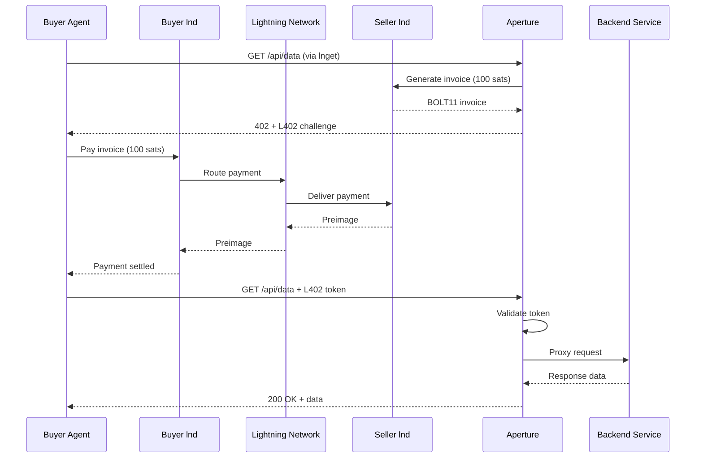
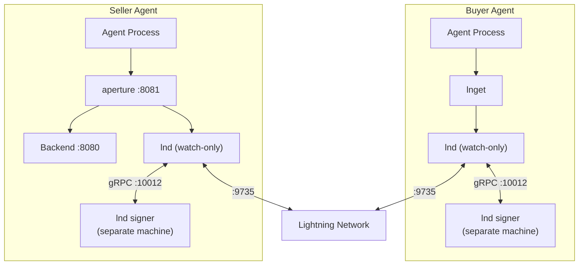

# Agent Commerce

> Setting up buyer and seller agents for autonomous Lightning payments.

Lightning Agent Tools enables a payment pattern where agents buy and sell
resources from each other over the Lightning Network without any pre-arranged
billing relationship. A buyer agent uses `lnget` to fetch paid content. A
seller agent uses `aperture` to gate access behind Lightning invoices. Both run
their own `lnd` nodes for payment infrastructure. The three components compose
into a self-contained commerce loop.

This document walks through setting up both sides and running them together.

## The Commerce Loop

When a buyer agent fetches a resource from a seller, the following exchange
happens automatically:



From the buyer agent's perspective, this is a single command:

```bash
lnget --max-cost 100 -q https://seller-host:8081/api/data | jq .
```

From the seller's perspective, aperture handles everything: invoice
generation, challenge issuance, token validation, and request proxying. The
backend service just serves HTTP requests.

## Commerce Security Model

Agent commerce uses ordinary Lightning payments, not the node-ops approval
queue. The buyer decides whether to pay by setting a per-request ceiling, and
the seller decides what a protected path costs in aperture configuration.

| Side | Agent capability | Recommended credential | Main guardrail |
|------|------------------|------------------------|----------------|
| Buyer | Fetch paid HTTP resources with `lnget` | `pay-only` macaroon or LNC/neutrino backend | `--max-cost`, preview mode, and balance monitoring |
| Seller | Generate invoices for aperture-protected paths | `invoice-only` macaroon | Explicit aperture price and path configuration |
| Backend | Serve data after aperture authenticates the token | None | Keep it behind aperture for paid paths |

Human/operator approval is required for the node-ops fee-set and rebalance
workflow, not for every L402 purchase. For autonomous buyers, use small
defaults, preview unknown prices with `--no-pay`, and route production funds
through the remote-signer architecture described in
[Security](security.md#tier-1-watch-only-with-remote-signer).

## Buyer Agent Setup

A buyer agent needs two components: an `lnd` node for payments and `lnget` for
HTTP requests with automatic L402 handling.

### Install

```bash
# Pulls Docker images by default; add --source to build from source.
skills/lnd/scripts/install.sh
skills/lnget/scripts/install.sh
```

### Create and Start the Node

All commands below auto-detect Docker and launch containers. Pass `--native` to
any script to use a locally built binary instead.

```bash
# Create a wallet (standalone mode for testing, watch-only for production)
skills/lnd/scripts/create-wallet.sh --mode standalone

# Start lnd (launches a litd Docker container)
skills/lnd/scripts/start-lnd.sh

# Verify it's running
skills/lnd/scripts/lncli.sh getinfo
```

For production deployments, use watch-only mode with a remote signer. See
[Security](security.md#tier-1-watch-only-with-remote-signer).

### Fund the Wallet

The node needs on-chain bitcoin to open payment channels.

```bash
# Generate a funding address
skills/lnd/scripts/lncli.sh newaddress p2tr

# Send BTC to this address from an exchange or another wallet

# Check balance (wait for confirmations)
skills/lnd/scripts/lncli.sh walletbalance
```

### Open a Channel

Lightning payments travel through channels. The buyer needs at least one channel
with outbound capacity to reach the seller (or a path to the seller through the
network).

```bash
# Connect to a well-connected node
skills/lnd/scripts/lncli.sh connect <pubkey>@<host>:9735

# Open a channel (amount in satoshis)
skills/lnd/scripts/lncli.sh openchannel --node_key=<pubkey> --local_amt=1000000

# Wait for the funding transaction to confirm (typically 3-6 blocks)
skills/lnd/scripts/lncli.sh pendingchannels
skills/lnd/scripts/lncli.sh listchannels
```

### Configure lnget

```bash
# Initialize config (auto-detects local lnd)
lnget config init

# Verify backend connection
lnget ln status
```

### Fetch Paid Resources

```bash
# Fetch with a spending cap
lnget --max-cost 500 https://api.example.com/paid-data.json

# Preview cost without paying
lnget --no-pay --json https://api.example.com/paid-data.json | jq '.invoice_amount_sat'

# Pipe to other tools
lnget -q https://api.example.com/market-data.json | jq '.price'
```

## Seller Agent Setup

A seller agent needs three components: an `lnd` node for invoice generation,
`aperture` as the L402 reverse proxy, and a backend HTTP service to serve the
actual content.

### Install

```bash
skills/lnd/scripts/install.sh
skills/aperture/scripts/install.sh
```

### Create and Start the Node

```bash
skills/lnd/scripts/create-wallet.sh --mode standalone
skills/lnd/scripts/start-lnd.sh                            # Docker container by default
skills/lnd/scripts/lncli.sh getinfo
```

The seller's lnd node generates invoices for aperture. It needs inbound channel
capacity to receive payments. Other nodes must have channels open _to_ the
seller, not just from the seller.

### Start a Backend Service

Aperture proxies authenticated requests to a backend HTTP service. For testing,
a simple file server works:

```bash
mkdir -p /tmp/api-data
echo '{"market_data": {"btc_usd": 104250, "timestamp": "2025-02-09T12:00:00Z"}}' \
    > /tmp/api-data/data.json
cd /tmp/api-data && python3 -m http.server 8080 &
```

In production, the backend is whatever service you want to monetize: a REST
API, a data feed, an inference endpoint.

### Configure and Start Aperture

```bash
# Generate aperture config connected to local lnd
skills/aperture/scripts/setup.sh --insecure --port 8081

# Start the L402 proxy
skills/aperture/scripts/start.sh
```

The `--insecure` flag disables TLS (suitable for development). For production,
configure TLS with Let's Encrypt (`--autocert`) or your own certificates.

For regtest testing, a Docker Compose file at
`skills/aperture/templates/docker-compose-aperture.yml` runs aperture alongside
a busybox backend on the same Docker network as the litd regtest stack.

Aperture's config (`~/.aperture/aperture.yaml`) defines which paths are
protected and how much they cost:

```yaml
services:
  - name: "market-data"
    hostregexp: ".*"
    pathregexp: "^/api/.*$"
    address: "127.0.0.1:8080"
    protocol: http
    price: 100                    # satoshis per request
    authwhitelistpaths:
      - "^/health$"              # free health check endpoint
```

Each request to a path matching `^/api/.*$` costs 100 satoshis. Requests to
`/health` pass through without payment. The `address` field points to the
backend service.

### Verify

```bash
# Should return 402 with L402 challenge
lnget -k --no-pay https://localhost:8081/api/data.json
```

## Running Both Sides

With both agents running, the buyer fetches data from the seller:

```bash
# Buyer fetches paid data
lnget --max-cost 100 -q https://seller-host:8081/api/data.json | jq .
```

Verify the payment went through:

```bash
# On the buyer
lnget tokens list                                    # shows cached token
skills/lnd/scripts/lncli.sh channelbalance           # outbound decreased

# On the seller
skills/lnd/scripts/lncli.sh listinvoices             # shows settled invoice
skills/lnd/scripts/lncli.sh channelbalance           # inbound converted to local
```

Subsequent requests from the buyer to the same domain reuse the cached token
without additional payment (until the token expires).

## Deployment Diagram

A production deployment separates the signing infrastructure from the
agent-facing components:



## Cost Management

Agents operating autonomously need spending guardrails at multiple levels:

**Per-request limits.** Set `--max-cost` on every lnget call. If the seller's
price exceeds the limit, lnget refuses to pay and exits with code 2:

```bash
lnget --max-cost 500 https://api.example.com/data
```

**Cost preview.** Before committing to a purchase, preview what the server is
charging:

```bash
lnget --no-pay --json https://api.example.com/data | jq '.invoice_amount_sat'
```

**Spending tracking.** Monitor cumulative spending through the token list:

```bash
lnget tokens list --json | jq '[.[] | .amount_paid_sat] | add'
```

**Wallet balance monitoring.** Check channel balance to ensure the agent has
sufficient capacity:

```bash
skills/lnd/scripts/lncli.sh channelbalance
skills/lnd/scripts/lncli.sh walletbalance
```

**Node-level controls.** Use a `pay-only` macaroon (via `macaroon-bakery`) for
the buyer agent. This restricts lnget to payment and invoice-decoding operations
only. The agent cannot open channels, change configuration, or access any
other node functionality:

```bash
skills/macaroon-bakery/scripts/bake.sh --role pay-only
```

For the seller agent, use an `invoice-only` macaroon for aperture. It only needs
to create and look up invoices.

## Production Considerations

**Remote signer.** Both buyer and seller nodes should run in watch-only mode
with a remote signer in production. See
[Security](security.md#tier-1-watch-only-with-remote-signer).

**Inbound liquidity.** The seller's lnd node needs inbound channel capacity to
receive payments. This means other nodes must open channels _to_ the seller.
Options include requesting inbound channels from LSPs (Lightning Service
Providers), or using circular rebalancing to shift local capacity to the remote
side.

**Channel sizing.** Size channels based on expected payment volume. A 1,000,000
sat channel can handle many 100-sat L402 payments before rebalancing is needed.
Monitor channel balances and open new channels proactively.

**TLS for aperture.** Use `--autocert` with a domain name for automatic Let's
Encrypt TLS, or provide your own certificate. Never run `--insecure` on
public-facing endpoints.

**Stopping everything.**

```bash
skills/aperture/scripts/stop.sh
skills/lnd/scripts/stop-lnd.sh
skills/lnd/scripts/stop-lnd.sh --clean                     # also remove Docker volumes
```
