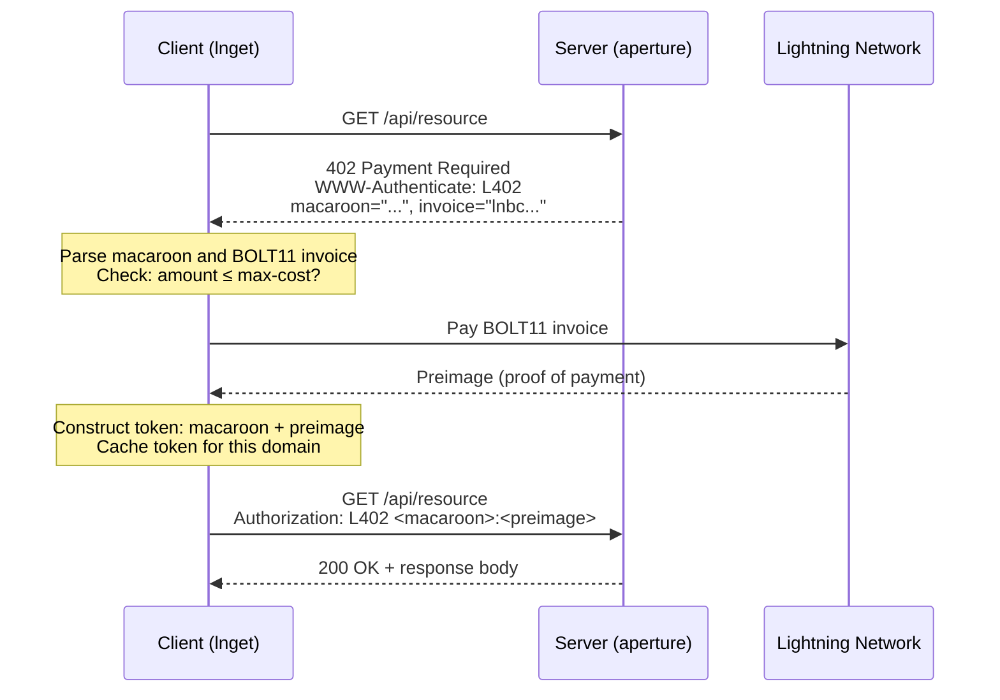
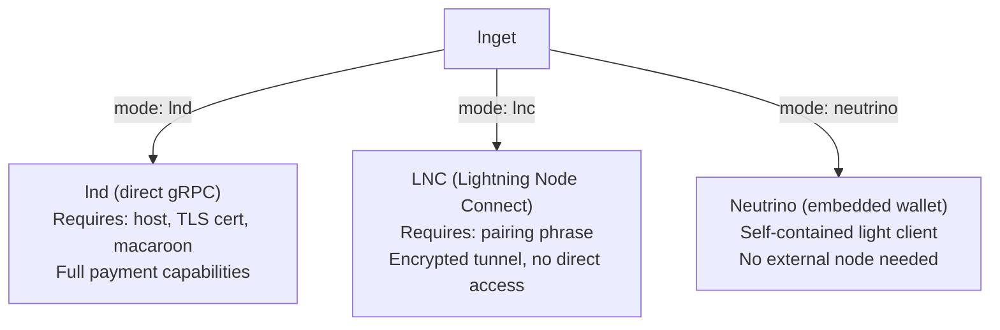

# L402 and lnget

> The payment protocol that makes agent commerce work, and the CLI client that
> automates it.

L402 is an HTTP authentication scheme built on Lightning Network payments. It
repurposes the HTTP 402 "Payment Required" status code, reserved since the
early days of the HTTP spec but never widely adopted, to gate access to web
resources behind Lightning invoices. An agent doesn't need an account, an API
key, or a pre-existing relationship with the server. It pays a Lightning invoice
and receives access. That's it.

`lnget` is a command-line HTTP client (in the tradition of `wget` and `curl`)
that handles L402 payments automatically. When it encounters a 402 response, it
pays the embedded invoice, caches the resulting token, and retries the request.
To the agent, the paid resource looks like any other HTTP fetch.

## The L402 Protocol

An L402 exchange has four steps:



**Step 1: The challenge.** The client requests a protected resource. The server
responds with HTTP 402 and a `WWW-Authenticate` header containing two values: a
macaroon (a bearer token encoding the access grant) and a BOLT11 Lightning
invoice (the payment request).

**Step 2: Payment.** The client decodes the BOLT11 invoice, verifies the amount
is acceptable, and pays it through the Lightning Network. Payment settlement
reveals a preimage, a 32-byte value that serves as cryptographic proof of
payment.

**Step 3: Token construction.** The client combines the macaroon from the
challenge with the preimage from the payment to form an L402 token. This token
is cached locally for future requests to the same domain.

**Step 4: Authenticated retry.** The client retries the original request with an
`Authorization: L402 <macaroon>:<preimage>` header. The server validates the
token (verifying that the preimage matches the payment hash embedded in the
macaroon) and serves the resource.

The key property of L402 is that credentials are **purchased, not provisioned**.
There is no signup flow, no API key management, no OAuth dance. Any client with
access to the Lightning Network can authenticate with any L402 server
instantly. This is what makes L402 native to agent workflows: agents can
discover and pay for resources on the fly without requiring a human to pre-register
accounts.

## Buyer and Seller Responsibilities

L402 splits responsibility cleanly between the buyer, seller, and Lightning
nodes:

| Role | Component | Responsibility | Credential to scope |
|------|-----------|----------------|---------------------|
| Buyer agent | `lnget` | Detect 402 challenges, enforce cost limits, pay invoices, cache tokens, retry requests | `pay-only` macaroon, LNC pairing, or neutrino wallet |
| Buyer node | lnd or lnget's selected backend | Route the Lightning payment and return the preimage | Remote-signer setup for production funds |
| Seller proxy | `aperture` | Price protected paths, generate challenges, validate tokens, proxy paid requests | `invoice-only` macaroon |
| Seller backend | Any HTTP service | Serve the resource after aperture authenticates the request | No Lightning credential required |

The L402 token proves a specific payment for a server challenge. It is not a
wallet key and cannot spend funds by itself, but it can grant access to the paid
resource until it expires. Store token caches with the same care as other bearer
tokens.

## lnget

`lnget` automates the entire L402 flow in a single command:

```bash
lnget https://api.example.com/premium-data.json
```

If the server returns 200, lnget writes the response to stdout (or a file with
`-o`). If it returns 402, lnget parses the challenge, pays the invoice, caches
the token, and retries. All of this is transparent. Subsequent requests to the same
domain reuse the cached token without additional payment.

### Installation

```bash
skills/lnget/scripts/install.sh
```

This runs `go install github.com/lightninglabs/lnget/cmd/lnget@latest`.

### Lightning Backends

lnget needs a Lightning backend to pay invoices. It supports three:



**lnd (direct gRPC).** Connects to an lnd node over gRPC using a TLS
certificate and macaroon. This is the standard mode when the agent runs its own
lnd node via the `lnd` skill. Configure with:

```bash
lnget config init  # auto-detects local lnd
```

Or manually in `~/.lnget/config.yaml`:

```yaml
ln:
  mode: lnd
  lnd:
    host: localhost:10009
    tls_cert: ~/.lnd/tls.cert
    macaroon: ~/.lnd/data/chain/bitcoin/mainnet/admin.macaroon
    network: mainnet
```

Use a `pay-only` macaroon instead of `admin.macaroon` for agents. See
[Security](security.md#preset-roles).

**LNC (Lightning Node Connect).** Connects through an encrypted WebSocket
tunnel using a pairing phrase. No direct network access to the lnd node is
needed. Pair with:

```bash
lnget ln lnc pair "your ten word pairing phrase from lightning terminal"
```

**Neutrino (embedded wallet).** lnget runs its own lightweight Lightning wallet
internally, using the Neutrino light client. No external lnd node required.
Initialize with:

```bash
lnget ln neutrino init
lnget ln neutrino fund  # generates a funding address
```

This mode is useful for quick experiments but has limited routing capability
compared to a full lnd node.

## Spending Controls

Autonomous agents should never have unlimited spending authority. lnget provides
two mechanisms for cost control:

**Per-request ceiling.** The `--max-cost` flag sets the maximum amount (in
satoshis) that lnget will auto-pay for a single request. If the invoice exceeds
this amount, lnget exits with code 2 without paying:

```bash
lnget --max-cost 500 https://api.example.com/data
```

**Preview mode.** The `--no-pay` flag sends the request and displays the L402
challenge (including the invoice amount) without paying. Agents can inspect
costs before committing:

```bash
lnget --no-pay --json https://api.example.com/data | jq '.invoice_amount_sat'
```

For node-level spending limits, use the `macaroon-bakery` to bake a `pay-only`
macaroon. This restricts the agent to payment operations only and prevents it
from opening channels, modifying configuration, or performing other
state-changing operations on the node.

These controls are separate from the `node-ops-daemon` approval queue. L402
purchases are buyer-initiated HTTP requests, so the normal guardrails are
`--max-cost`, preview mode, wallet/channel monitoring, and a scoped payment
credential. Fee-set and rebalance requests are different: they go through the
daemon because they mutate node policy or liquidity state.

### Exit Codes

| Code | Meaning |
|------|---------|
| 0 | Request succeeded |
| 1 | General error |
| 2 | Invoice amount exceeds `--max-cost` |
| 3 | Lightning payment failed |
| 4 | Network or connection error |

## Token Caching

Paid L402 tokens are cached at `~/.lnget/tokens/<domain>/` and reused
automatically on subsequent requests to the same domain. This means an agent
pays once per domain (until the token expires) rather than once per request.

Manage cached tokens with:

```bash
lnget tokens list                        # list all cached tokens
lnget tokens show api.example.com        # show token for a specific domain
lnget tokens remove api.example.com      # remove a token (force re-payment)
lnget tokens clear --force               # clear all tokens
```

## Configuration

lnget reads its configuration from `~/.lnget/config.yaml`. Initialize it with:

```bash
lnget config init    # creates config with defaults, auto-detects local lnd
lnget config show    # display current config
lnget config path    # print config file path
```

The config file controls L402 behavior, HTTP settings, Lightning backend
selection, and output formatting:

```yaml
l402:
  max_cost_sats: 1000          # default spending ceiling
  max_fee_sats: 10             # max routing fee
  payment_timeout: 60s
  auto_pay: true               # pay automatically on 402

http:
  timeout: 30s
  max_redirects: 10
  user_agent: "lnget/0.1.0"
  allow_insecure: false        # set true for self-signed certs (dev only)

ln:
  mode: lnd                    # lnd | lnc | neutrino

output:
  format: json
  progress: true
  verbose: false

tokens:
  dir: ~/.lnget/tokens
```

## Common Usage Patterns

```bash
# Fetch and pipe to jq
lnget -q https://api.example.com/data.json | jq .

# Save to file
lnget -o data.json https://api.example.com/data.json

# POST with body
lnget -X POST -d '{"query":"test"}' https://api.example.com/search

# Check backend connection
lnget ln status
lnget ln info

# Track total spending
lnget tokens list --json | jq '[.[] | .amount_paid_sat] | add'
```

## The Server Side: Aperture

lnget handles the client side of L402. On the server side,
[Aperture](https://github.com/lightninglabs/aperture) is an L402-aware reverse
proxy that sits in front of a backend HTTP service and gates access behind
Lightning payments.

Aperture handles invoice generation (through its connected lnd node), L402
challenge issuance, token validation, and request proxying. The backend service
doesn't need any awareness of Lightning or L402. It just serves HTTP requests
that arrive through aperture.

For a complete walkthrough of setting up both the client and server sides, see
[Commerce](commerce.md).
