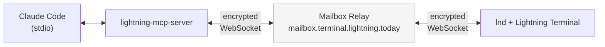

# MCP Server

> Connecting AI assistants to Lightning nodes through the Model Context
> Protocol and Lightning Node Connect.

Lightning Agent Tools includes an MCP server that gives AI assistants
read-only Lightning Node Connect (LNC) access to a Lightning node plus a narrow
node-ops integration for daemon-gated local writes. LNC transport means the
assistant never needs direct network access to the node, never handles TLS
certificates, and never stores macaroons on disk. A 10-word pairing phrase is
all it takes to establish an encrypted tunnel.

The server exposes 24 tools. The LNC tools are read-only and let an assistant
query node status, inspect channels, decode invoices, look up payments, and
explore the network graph. The only write paths are `lnc_execute_fee_set` and
`lnc_execute_rebalance`, which submit bounded requests to `node-ops-daemon`; the
MCP server never receives LND write credentials and the daemon enforces caps,
cooldowns, approvals, the kill-switch, and audit logging before any node write.

## How LNC Works

Lightning Node Connect establishes an end-to-end encrypted WebSocket tunnel
between two parties through a mailbox relay server. Both the MCP server (on the
agent's machine) and the lnd node (running Lightning Terminal) connect outbound
to the mailbox. Neither needs to accept inbound connections, which means no
firewall configuration and no port forwarding.



Authentication works through a 10-word pairing phrase generated in Lightning
Terminal. When the MCP server connects, it generates an ephemeral ECDSA keypair,
uses the pairing phrase to derive a shared secret, and establishes the encrypted
tunnel. The keypair exists only in memory for the duration of the session --
when the connection closes, the keypair is discarded and no credentials remain
on disk.

The mailbox relay cannot read the traffic passing through it. It sees encrypted
WebSocket frames and routes them between the two endpoints based on connection
identifiers derived from the pairing phrase.

## Setup

Three scripts handle the full setup:

### 1. Build the server

```bash
skills/lightning-mcp-server/scripts/install.sh
```

This compiles `lightning-mcp-server` from the `lightning-mcp-server/` directory in the
repository and installs it to `$GOPATH/bin`. Requires Go 1.24+.

### 2. Configure the environment

```bash
# Production (Lightning Terminal on mainnet)
skills/lightning-mcp-server/scripts/configure.sh --production

# Development (local regtest)
skills/lightning-mcp-server/scripts/configure.sh --dev --mailbox aperture:11110
```

This generates `lightning-mcp-server/.env` with the following variables:

| Variable | Default | Description |
|----------|---------|-------------|
| `LNC_MAILBOX_SERVER` | `mailbox.terminal.lightning.today:443` | Mailbox relay address |
| `LNC_DEV_MODE` | `false` | Enable development mode |
| `LNC_INSECURE` | `false` | Skip TLS verification (dev only) |
| `LNC_CONNECT_TIMEOUT` | `30` | Connection timeout in seconds |

### 3. Register with Claude Code

```bash
# Project-level (recommended)
skills/lightning-mcp-server/scripts/setup-claude-config.sh --scope project

# Global
skills/lightning-mcp-server/scripts/setup-claude-config.sh --scope global
```

This adds the MCP server to `.mcp.json` (project) or `~/.claude.json` (global).
Restart Claude Code after running this script for the new tools to appear.

The resulting configuration looks like:

```json
{
  "mcpServers": {
    "lnc": {
      "command": "lightning-mcp-server",
      "env": {
        "LNC_MAILBOX_SERVER": "mailbox.terminal.lightning.today:443"
      }
    }
  }
}
```

### 4. Connect

After restarting Claude Code, the `lnc_connect` tool becomes available. Connect
with a pairing phrase from Lightning Terminal:

```
Connect to my Lightning node with pairing phrase: "word1 word2 word3 word4 word5 word6 word7 word8 word9 word10"
```

The assistant will call `lnc_connect`, establish the tunnel, and then the
LNC-backed read tools become operational. Local node-ops tools use the
`node-ops-daemon` Unix socket and do not use the LNC session.

## Available Tools

The server organizes its tools into these categories:

### Connection

| Tool | Description |
|------|-------------|
| `lnc_connect` | Establish LNC tunnel with a pairing phrase and password |
| `lnc_disconnect` | Close the active tunnel and discard the ephemeral keypair |

### Node

| Tool | Description |
|------|-------------|
| `lnc_get_info` | Node alias, public key, version, sync status, current block height |
| `lnc_get_balance` | On-chain wallet balance and total channel balance |

### Channels

| Tool | Description |
|------|-------------|
| `lnc_list_channels` | All open channels with capacity, local/remote balances, and activity |
| `lnc_pending_channels` | Channels being opened, closed, or force-closed |
| `lnc_propose_channel_actions` | Read-only recommendations for channel actions |

### Invoices

| Tool | Description |
|------|-------------|
| `lnc_decode_invoice` | Decode a BOLT11 payment request into its components |
| `lnc_list_invoices` | Paginated list of created invoices with status |
| `lnc_lookup_invoice` | Look up a specific invoice by payment hash |

### Payments

| Tool | Description |
|------|-------------|
| `lnc_list_payments` | Paginated payment history with status, amounts, and routes |
| `lnc_track_payment` | Track a specific in-flight or completed payment by hash |

### Health

| Tool | Description |
|------|-------------|
| `lnc_node_health` | Read-only health summary and alert signals |

### Fees

| Tool | Description |
|------|-------------|
| `lnc_propose_fees` | Read-only fee policy recommendations |

### Rebalance

| Tool | Description |
|------|-------------|
| `lnc_propose_rebalance` | Read-only circular rebalance candidates |

### Peers and Network

| Tool | Description |
|------|-------------|
| `lnc_list_peers` | Connected peers with addresses, bytes sent/received, and ping times |
| `lnc_describe_graph` | Sample of the Lightning Network topology (nodes and channels) |
| `lnc_get_node_info` | Detailed information about a specific node by public key |

### On-Chain

| Tool | Description |
|------|-------------|
| `lnc_list_unspent` | Unspent transaction outputs (UTXOs) with confirmation counts |
| `lnc_get_transactions` | On-chain transaction history |
| `lnc_estimate_fee` | Fee rate estimates for target confirmation windows |

### Node Ops

| Tool | Description |
|------|-------------|
| `lnc_query_node_ops_audit` | Query the local node-ops audit ledger |
| `lnc_execute_fee_set` | Submit a gated fee policy update to `node-ops-daemon` |
| `lnc_execute_rebalance` | Submit a gated circular rebalance to `node-ops-daemon` |

## MCP-LNC vs Direct gRPC

The MCP server and direct gRPC access (via `lncli` or the `lnd` skill) serve
different purposes:

| | MCP-LNC | Direct gRPC |
|---|---------|-------------|
| **Credentials** | Pairing phrase (in-memory) | TLS cert + macaroon (on disk) |
| **Network** | WebSocket via mailbox relay | Direct TCP to gRPC port |
| **Firewall** | No inbound ports needed | Port 10009 must be reachable |
| **Capabilities** | Read-only LNC query tools plus daemon-gated node-ops requests | Full node control |
| **Permissions** | Read-only LNC tools plus daemon-gated node-ops approvals | Configurable via macaroon scope |
| **Setup** | Pairing phrase from Lightning Terminal | Export TLS cert and macaroon files |

**Use MCP-LNC when** the agent needs to observe node state: checking balances,
listing channels, monitoring payments, inspecting the network graph. For the
supported fee-set and rebalance writes, use the node-ops daemon path so
credentials, approval, limits, and audit stay outside the model-callable LNC
session. Fee-set and rebalance requests are submitted through MCP tools but
execute only after an operator approves on the separate operator socket with the
private operator token.

**Use direct gRPC when** the agent needs to perform actions: sending payments,
opening channels, creating invoices. Direct gRPC requires the `lnd` skill and
appropriate macaroons (scoped via `macaroon-bakery`).

## Server Internals

The MCP server is a Go application in the `lightning-mcp-server/` directory. It runs on
stdio transport. The MCP client launches it as a subprocess and communicates over
stdin/stdout.

The entry point (`daemon.go`) handles signal-based shutdown (SIGINT, SIGTERM)
with a graceful timeout. The server (`server.go`) initializes a service manager
(`internal/services/manager.go`) that creates one service per tool category and
registers the tools with the
[MCP Go SDK](https://github.com/modelcontextprotocol/go-sdk).

When `lnc_connect` is called, the manager creates a Lightning client using the
LNC library (`github.com/lightninglabs/lightning-node-connect/mailbox`),
establishes the tunnel, and distributes the client to all services via the
`onLNCConnectionEstablished` callback. When `lnc_disconnect` is called, the
connection is closed and all services are reset.

### Building from Source

```bash
cd lightning-mcp-server
make build           # debug binary
make build-release   # optimized binary
make install         # install to $GOPATH/bin
make check           # run fmt, lint, mod-check, and unit tests
```

### Docker

For containerized deployment:

```bash
cd lightning-mcp-server
make docker-build
```

The Docker configuration in `.mcp.json`:

```json
{
  "mcpServers": {
    "lnc": {
      "command": "docker",
      "args": [
        "run", "--rm", "-i", "--network", "host",
        "--env", "LNC_MAILBOX_SERVER",
        "--env", "LNC_DEV_MODE",
        "--env", "LNC_INSECURE",
        "lightning-mcp-server"
      ]
    }
  }
}
```

## Development Setup

For local regtest environments, enable development mode to skip TLS verification
and connect to a local mailbox:

```bash
skills/lightning-mcp-server/scripts/configure.sh --dev --mailbox localhost:11110 --insecure
```

This sets `LNC_DEV_MODE=true` and `LNC_INSECURE=true` in the `.env` file.

### Prerequisites

- **Go 1.24+** for building from source
- **Lightning Terminal** (litd) on the target lnd node for generating pairing
  phrases
- **Claude Code** for MCP integration

### Troubleshooting

**"pairing phrase must be exactly 10 words"**: The pairing phrase is generated
in Lightning Terminal's Sessions UI. It must be exactly 10 space-separated
words.

**"connection timeout"**: Verify the mailbox server is reachable. For
production, this is `mailbox.terminal.lightning.today:443`. For local
development, ensure the local mailbox is running.

**"TLS handshake failure"**: For local regtest, enable insecure mode:
`skills/lightning-mcp-server/scripts/configure.sh --dev --insecure`

**Tools not appearing in Claude Code**: Restart Claude Code after running
`setup-claude-config.sh`. Verify the binary is on your PATH with
`which lightning-mcp-server`.
