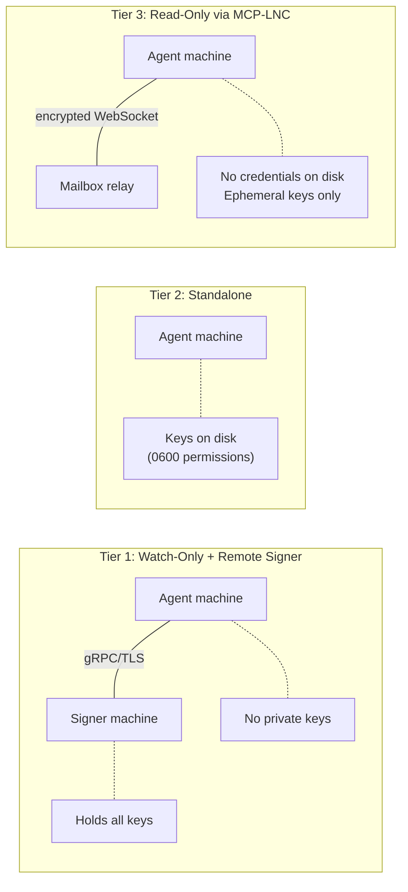
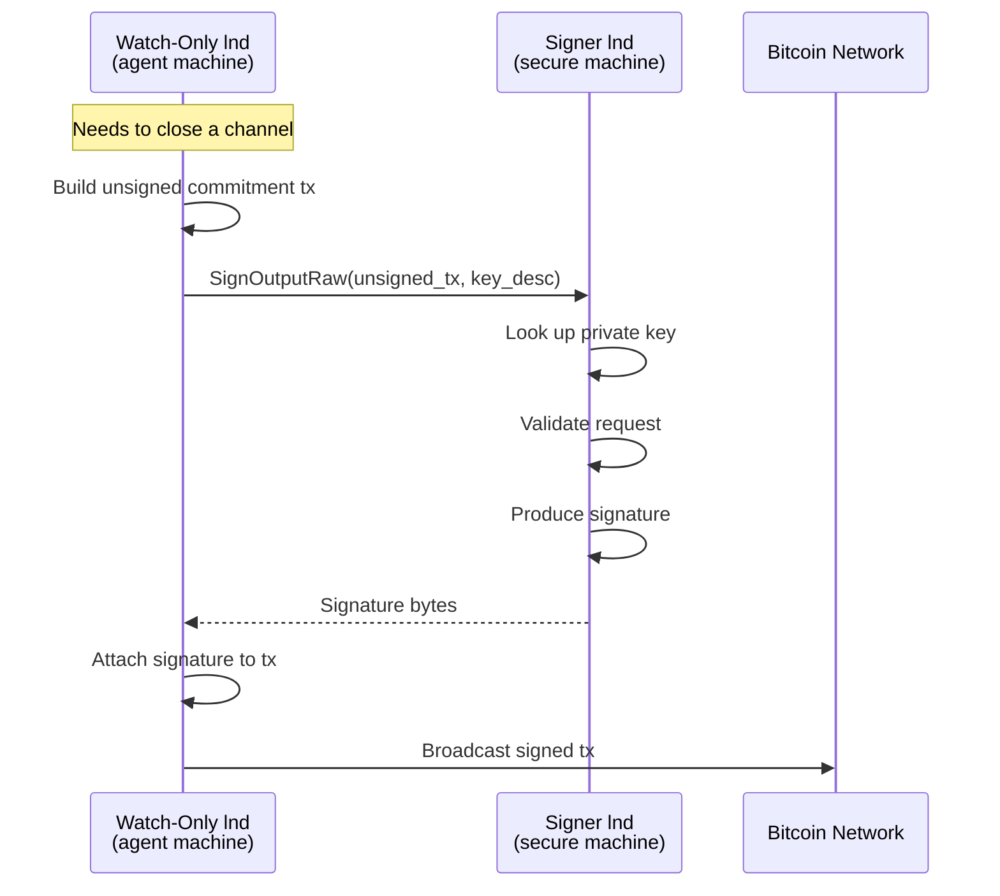

# Security Model

> How Lightning Agent Tools isolates private keys, scopes credentials, and
> controls what agents can do.

Agents that handle real bitcoin need a security model built for autonomous
operation. The core principle is straightforward: give the agent the minimum
credentials required for its task and keep private keys on a separate machine.
The kit enforces this through three tiers of access, each with different trust
assumptions and failure modes.

## Three Tiers of Access



### Tier 1: Watch-Only with Remote Signer

This is the default and recommended configuration. The agent machine runs an
lnd node in watch-only mode. It can see balances, manage channels, and route
payments, but it has no private keys. All signing is delegated to a separate
signer node over an authenticated gRPC connection.

**What the agent machine has:**
- Account xpubs (public keys for address derivation)
- A TLS certificate and macaroon for the signer's gRPC interface
- Scoped macaroons for the local lnd (baked via `macaroon-bakery`)

**What the agent machine does not have:**
- The wallet seed
- Any private keys (funding, revocation, HTLC, or on-chain)

**If the agent machine is compromised,** an attacker can observe channel state,
balances, and payment history. They can see which peers the node is connected to
and the topology of its channels. But they cannot sign transactions, sweep
funds, or forge channel commitment updates. The keys are simply not there.

**If the signer machine is compromised,** the attacker has full control over all
private keys and can sign arbitrary transactions. This is a complete compromise.
The signer machine should have a minimal attack surface: no public-facing
services, restricted network access (only the watch-only node should reach port
10012), and ideally dedicated hardware.

**Setup:** Use the `lightning-security-module` skill on the signer machine and
the `lnd` skill in watch-only mode on the agent machine. See
[Architecture](architecture.md#remote-signer) for the signing flow.

### Tier 2: Standalone

The node generates its own seed and stores it locally. The 24-word mnemonic is
written to `~/.lnget/lnd/seed.txt` and the wallet passphrase to
`~/.lnget/lnd/wallet-password.txt`, both with mode 0600.

This mode is appropriate for:
- Testnet and regtest development
- Small-value experiments on mainnet
- Environments where a separate signer machine is impractical

It is **not appropriate** for production deployments with significant funds.
Anyone with read access to `~/.lnget/lnd/seed.txt` can reconstruct the wallet's
private keys.

**Setup:** Pass `--mode standalone` to `create-wallet.sh`.

### Tier 3: Read-Only via MCP-LNC

The MCP server connects to a Lightning node through an encrypted LNC tunnel
using a 10-word pairing phrase. No credentials are written to disk. The
pairing phrase is handled in memory and an ephemeral ECDSA keypair is generated
per session. When the session ends, the keypair is discarded.

This tier exposes read-only LNC tools. The agent can query balances, list
channels, decode invoices, and inspect the network graph through LNC. Supported
node-ops writes are not direct LNC mutations; they are local daemon requests
with scoped credentials, limits, approvals, and audit logging enforced outside
the MCP session.

**If the agent machine is compromised,** the attacker gains read access to the
node's state for the duration of the active LNC session. Once the session is
closed, no credentials remain to reconnect.

**Setup:** Use the `lightning-mcp-server` skill. See [MCP Server](mcp-server.md) for the
setup walkthrough.

## Remote Signer in Depth

The remote signer splits a Lightning node into two processes. The signer runs
lnd with the seed and private keys but does not connect to the peer-to-peer
network, does not route payments, and does not manage channels. The watch-only
node does everything else. By default, both run in Docker containers
(`litd-signer` and `litd` respectively); pass `--native` to scripts for local
binary mode.

### Credential Bundle

When you run `setup-signer.sh`, the signer creates a wallet and exports a
credentials bundle to `~/.lnget/signer/credentials-bundle/`:

| File | What it contains | What it's used for |
|------|-----------------|-------------------|
| `accounts.json` | Account xpubs (public keys) | Watch-only wallet creation |
| `tls.cert` | Signer's TLS certificate | Authenticating the gRPC connection |
| `admin.macaroon` | Signer's admin macaroon | Authorizing signing RPCs |

A base64 tarball (`credentials-bundle.tar.gz.b64`) is also generated for
transfer. On the agent machine, `import-credentials.sh` unpacks it into
`~/.lnget/lnd/signer-credentials/`.

### Signing Protocol

The watch-only node constructs transactions locally and sends them to the signer
for signature via gRPC. The signer validates each request, signs with the
appropriate key, and returns the signature. The watch-only node then assembles
and broadcasts the signed transaction.



The gRPC connection between the watch-only node and the signer is secured with
mutual TLS. The watch-only node uses the signer's exported TLS certificate
(`tls.cert`) to verify the server's identity. The macaroon provides
authorization.

### Hardening the Signer

For production deployments:

- **Scope the signer macaroon.** Replace `admin.macaroon` with a `signer-only`
  macaroon baked via `macaroon-bakery`. This restricts the watch-only node to
  signing operations and key derivation. It cannot call any other RPC on the
  signer.

  ```bash
  # Container mode (auto-detects litd-signer)
  skills/macaroon-bakery/scripts/bake.sh --role signer-only --container litd-signer

  # Native mode
  skills/macaroon-bakery/scripts/bake.sh --role signer-only \
      --rpc-port 10012 --lnddir ~/.lnd-signer
  ```

- **Firewall the signer.** Only the watch-only node's IP should be able to
  reach port 10012. Block all other inbound traffic.

- **Dedicate the hardware.** Run the signer on a separate machine or hardened
  VM with no other services. Minimize the installed software and disable remote
  access except through a controlled management channel.

- **Rotate macaroons.** Bake new macaroons periodically and update the
  watch-only node's configuration. The old root key can be revoked to
  invalidate the previous macaroon.

## Macaroon Security

Macaroons are bearer tokens. Anyone who has a copy of a macaroon can exercise
its permissions against the lnd node that issued it. Treat them like passwords:
store them with restrictive file permissions (0600), don't commit them to
version control, and don't transmit them over unencrypted channels.

### Preset Roles

The `macaroon-bakery` skill provides five preset roles that cover common agent
use cases. Each role grants the minimum set of RPC permissions needed:

| Role | Permissions granted | Typical use case |
|------|-------------------|-----------------|
| `pay-only` | `SendPaymentSync`, `DecodePayReq`, `GetInfo` | Agent that buys L402 resources via lnget |
| `invoice-only` | `AddInvoice`, `LookupInvoice`, `ListInvoices`, `GetInfo` | Agent that sells resources via aperture |
| `read-only` | `GetInfo`, `WalletBalance`, `ChannelBalance`, `ListChannels`, `ListPeers`, `ListPayments`, `ListInvoices` | Monitoring and reporting |
| `channel-admin` | Everything in `read-only` + `OpenChannelSync`, `CloseChannel`, `ConnectPeer` | Node management |
| `signer-only` | `SignOutputRaw`, `ComputeInputScript`, `MuSig2Sign`, `DeriveKey`, `DeriveNextKey` | Remote signer credentials |

### Custom Macaroons

For permissions that don't fit a preset role, bake a custom macaroon with
specific URI permissions:

```bash
skills/macaroon-bakery/scripts/bake.sh --custom \
    uri:/lnrpc.Lightning/SendPaymentSync \
    uri:/lnrpc.Lightning/DecodePayReq \
    uri:/lnrpc.Lightning/WalletBalance \
    uri:/lnrpc.Lightning/GetInfo
```

The full list of available permission URIs is available via:

```bash
skills/macaroon-bakery/scripts/bake.sh --list-permissions
```

### Rotation

Macaroon rotation involves baking a new macaroon, updating the agent's
configuration to use it, and optionally revoking the old root key:

```bash
# Bake replacement
skills/macaroon-bakery/scripts/bake.sh --role pay-only \
    --save-to ~/pay-only-v2.macaroon

# Update agent config to point at the new macaroon

# Revoke old root key (invalidates all macaroons baked with it)
skills/lnd/scripts/lncli.sh bakemacaroon --root_key_id 0
```

## Production Checklist

Before deploying the kit with real funds:

1. **Use the remote signer.** Set up `lightning-security-module` on a separate
   machine. Run the agent's lnd in watch-only mode. Do not use standalone mode
   for production.

2. **Scope all macaroons.** Bake role-specific macaroons for each agent. Never
   distribute `admin.macaroon`. A buyer agent gets `pay-only`; a seller agent
   gets `invoice-only`; a monitoring agent gets `read-only`.

3. **Scope the signer macaroon.** Replace the signer's `admin.macaroon` with
   a `signer-only` macaroon. The watch-only node only needs signing and key
   derivation permissions on the signer.

4. **Firewall the signer.** Restrict port 10012 to the watch-only node's IP.
   In container mode, port 10013 (REST) is bound to `0.0.0.0` for Docker
   networking but is only host-mapped during wallet setup. In native mode,
   `setup-signer.sh` rebinds REST to `localhost`.

5. **Secure credential files.** Verify that `wallet-password.txt`, `seed.txt`,
   and all `.macaroon` files have mode 0600. The kit's scripts set this
   automatically, but verify after any manual operations.

6. **Set spending limits.** Configure `--max-cost` on lnget commands to cap
   per-request spending. Monitor wallet balances programmatically.

7. **Back up the seed.** The signer's `seed.txt` is the only way to recover
   funds if the signer's storage fails. Store the 24-word mnemonic securely
   offline.

## Credential File Reference

Every credential and secret file the kit manages:

| File | Mode | Machine | Purpose |
|------|------|---------|---------|
| `~/.lnget/lnd/wallet-password.txt` | 0600 | Agent | lnd wallet unlock passphrase |
| `~/.lnget/lnd/seed.txt` | 0600 | Agent | 24-word mnemonic (standalone only) |
| `~/.lnget/lnd/signer-credentials/tls.cert` | 0644 | Agent | Signer's TLS cert |
| `~/.lnget/lnd/signer-credentials/admin.macaroon` | 0600 | Agent | Signer RPC auth |
| `~/.lnget/lnd/signer-credentials/accounts.json` | 0600 | Agent | Account xpubs |
| `~/.lnget/signer/wallet-password.txt` | 0600 | Signer | Signer wallet passphrase |
| `~/.lnget/signer/seed.txt` | 0600 | Signer | Signer 24-word mnemonic |
| `~/.lnd/data/chain/bitcoin/<network>/admin.macaroon` | 0600 | Agent | lnd admin macaroon |
| `~/.lnd-signer/data/chain/bitcoin/<network>/admin.macaroon` | 0600 | Signer | Signer admin macaroon |
| `~/.lnget/tokens/<domain>/` | 0700 | Agent | Cached L402 tokens |
| `~/.aperture/aperture.yaml` | 0600 | Seller | Aperture config (may contain credentials) |

**Container mode note:** In container deployments, daemon data directories
(`~/.lnd/`, `~/.lnd-signer/`) live inside Docker volumes (`litd-data`,
`signer-data`) rather than on the host filesystem. The host-side credential
files under `~/.lnget/` remain the same in both modes. Use `docker cp` or
`export-credentials.sh --container` to extract macaroons and TLS certs from
running containers.
