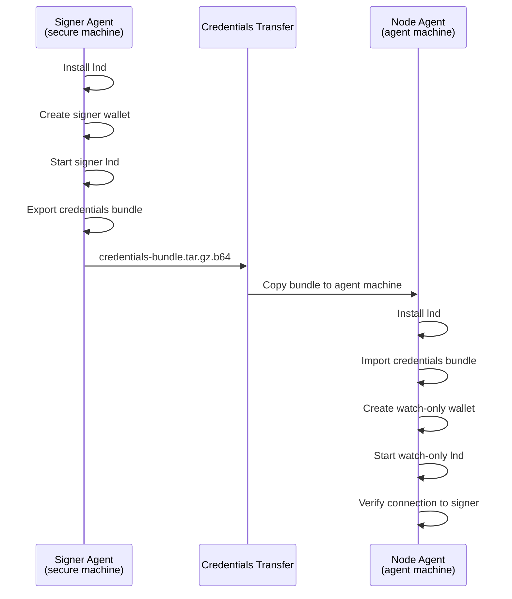
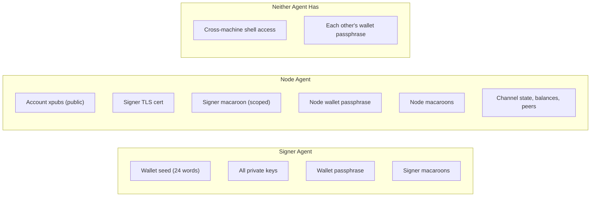
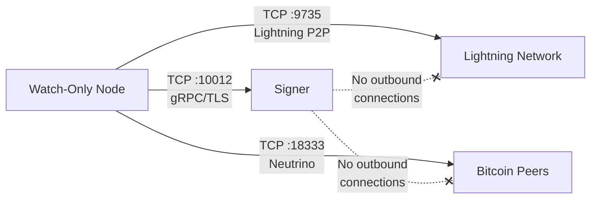

# Two-Agent Secure Setup

> Using one agent to set up the remote signer and another to run the
> watch-only node.

The recommended production deployment splits key management across two
machines: a signer that holds private keys and a node that handles payments
and channels. Each machine can be operated by its own agent. The signer agent
runs on the secure machine and exports a credentials bundle. The node agent
runs on the agent-facing machine, imports that bundle, and starts a watch-only
lnd instance that delegates all signing back to the signer.

This walkthrough covers the full flow from both sides.

## Overview



The credentials bundle contains three files:

| File | What it is | What it's for |
|------|-----------|---------------|
| `accounts.json` | Account xpubs (public keys only) | Creating the watch-only wallet |
| `tls.cert` | Signer's TLS certificate | Authenticating the gRPC connection |
| `admin.macaroon` | Signer's RPC token | Authorizing signing requests |

No private keys cross the wire. The bundle contains only public keys and
authentication material.

## Roles and Approval Boundaries

A production deployment usually has three distinct authority surfaces:

| Role | Runs where | Holds | Must not hold |
|------|------------|-------|---------------|
| Signer agent | Secure signer machine | Wallet seed, private keys, signer wallet passphrase, signer macaroons | Node agent wallet files or operator approval token |
| Node agent | Agent-facing machine | Watch-only wallet state, signer TLS cert, scoped signer macaroon, task-specific node macaroons | Wallet seed or private keys |
| Human/operator | Operator shell or service account | `~/.node-ops/operator.token` and access to the operator approval socket | Model-callable MCP session credentials |

The node agent can submit read-only MCP queries and, when configured, daemon
requests for fee-set or rebalance work. It should not be able to approve those
requests itself. Approval happens through the operator boundary, which is
separate from both the LNC pairing session and the MCP server process.

## Container Mode (Recommended)

Docker is the default deployment method. All scripts auto-detect containers
and route commands through `docker exec`.

### Signer Machine

```bash
# Pull the lnd signer image.
skills/lightning-security-module/scripts/install.sh

# Create the signer wallet and export the credentials bundle.
# This launches the litd-signer container, creates the wallet via REST API,
# and exports the bundle to ~/.lnget/signer/credentials-bundle/.
skills/lightning-security-module/scripts/setup-signer.sh

# Start the signer container (if not already running from setup).
skills/lightning-security-module/scripts/start-signer.sh
```

Transfer the credentials bundle to the agent machine:

```bash
scp ~/.lnget/signer/credentials-bundle/credentials-bundle.tar.gz.b64 \
    agent-machine:~/credentials-bundle.tar.gz.b64
```

### Agent Machine

```bash
# Pull the litd image.
skills/lnd/scripts/install.sh

# Import the signer's credentials bundle.
skills/lnd/scripts/import-credentials.sh --bundle ~/credentials-bundle.tar.gz.b64

# Create the watch-only wallet (auto-detects the litd container).
skills/lnd/scripts/create-wallet.sh

# Start in watch-only mode (launches litd + signer containers via Docker Compose).
skills/lnd/scripts/start-lnd.sh --watchonly

# Verify.
skills/lnd/scripts/lncli.sh getinfo
skills/lnd/scripts/lncli.sh newaddress p2tr
```

The `--watchonly` flag uses `docker-compose-watchonly.yml`, which starts both a
litd container (watch-only) and connects it to the signer via the Docker
network. The signer's gRPC address is pre-configured in the watch-only template
(`lnd.remotesigner.rpchost=signer:10012`).

### Container Lifecycle

```bash
# Stop containers.
skills/lnd/scripts/stop-lnd.sh

# Stop and remove volumes (destructive — removes chain data).
skills/lnd/scripts/stop-lnd.sh --clean

# On signer machine.
skills/lightning-security-module/scripts/stop-signer.sh
skills/lightning-security-module/scripts/stop-signer.sh --clean
```

### Scoping the Signer Macaroon (Container)

```bash
# On the signer machine, bake a scoped macaroon inside the container.
skills/macaroon-bakery/scripts/bake.sh --role signer-only --container litd-signer

# Re-export the credentials bundle with the scoped macaroon.
skills/lightning-security-module/scripts/export-credentials.sh --container litd-signer
```

---

## Native Mode

For environments without Docker, all scripts accept a `--native` flag to use
locally installed binaries.

### Part 1: Signer Agent (Secure Machine)

The signer agent runs on a machine with restricted access. This machine will
hold all private keys and never connect to the Lightning Network directly.

### Install lnd

```bash
skills/lightning-security-module/scripts/install.sh --source
```

This builds lnd from source with the signing-related build tags. The binary is
the same as a regular lnd install, but the signer's configuration restricts it
to signing operations only.

### Create the signer wallet and export credentials

```bash
skills/lightning-security-module/scripts/setup-signer.sh --native
```

This does three things:

1. Generates a new wallet with a random passphrase and 24-word seed mnemonic.
   Both are saved to `~/.lnget/signer/` with mode 0600.
2. Starts the signer lnd temporarily to extract account xpubs.
3. Exports the credentials bundle to
   `~/.lnget/signer/credentials-bundle/`.

The bundle directory contains the three files listed above plus a
base64-encoded tarball (`credentials-bundle.tar.gz.b64`) for easy transfer.

### Start the signer

```bash
skills/lightning-security-module/scripts/start-signer.sh --native
```

The signer listens on port 10012 (gRPC) for signing requests from the
watch-only node. In native mode, REST binds to `localhost:10013` only. It does
not connect to any peers and does not participate in the Lightning Network.

### Transfer the bundle

The base64-encoded bundle needs to reach the agent machine. How you transfer
it depends on your environment:

```bash
# Option 1: scp
scp ~/.lnget/signer/credentials-bundle/credentials-bundle.tar.gz.b64 \
    agent-machine:~/credentials-bundle.tar.gz.b64

# Option 2: Print to terminal and copy-paste
cat ~/.lnget/signer/credentials-bundle/credentials-bundle.tar.gz.b64
```

The bundle contains a macaroon (bearer token) and a TLS certificate. Treat it
like a password during transfer.

### Optional: scope the signer macaroon

The exported `admin.macaroon` grants full RPC access to the signer. For
production, replace it with a `signer-only` macaroon that restricts the
watch-only node to signing and key derivation:

```bash
skills/macaroon-bakery/scripts/bake.sh --role signer-only \
    --rpc-port 10012 --lnddir ~/.lnd-signer
```

Then re-export the credentials bundle with the scoped macaroon:

```bash
skills/lightning-security-module/scripts/export-credentials.sh
```

### Part 2: Node Agent (Agent Machine)

The node agent runs on the machine where agents will operate. This machine
will have no private keys.

### Install lnd

```bash
skills/lnd/scripts/install.sh --source
```

### Import the credentials bundle

```bash
skills/lnd/scripts/import-credentials.sh \
    --bundle ~/credentials-bundle.tar.gz.b64
```

This unpacks the bundle into `~/.lnget/lnd/signer-credentials/`, placing
`accounts.json`, `tls.cert`, and `admin.macaroon` where the watch-only node
expects them.

### Create the watch-only wallet

```bash
skills/lnd/scripts/create-wallet.sh --native \
    --signer-host <signer-ip>:10012
```

Replace `<signer-ip>` with the signer machine's IP address or hostname. This
creates a wallet that imports the account xpubs from the credentials bundle.
The wallet has no seed and no private keys. It generates a random passphrase
stored at `~/.lnget/lnd/wallet-password.txt` (mode 0600).

The `--signer-host` flag tells the wallet creation process where to find the
signer for initial key verification.

### Start the watch-only node

```bash
skills/lnd/scripts/start-lnd.sh --native \
    --signer-host <signer-ip>:10012
```

The node starts with `remotesigner.enable=true` in its config, pointing at
the signer's gRPC address. It connects to the Bitcoin network via Neutrino,
syncs headers, and begins normal operation. Any transaction that requires a
signature (channel opens, closes, on-chain sends) is forwarded to the signer
over the authenticated gRPC connection.

### Verify

```bash
skills/lnd/scripts/lncli.sh getinfo
```

The node should report synced status. To confirm the signer connection is
working, try generating a new address (which requires key derivation from the
signer):

```bash
skills/lnd/scripts/lncli.sh newaddress p2tr
```

If this returns an address, the watch-only node and signer are communicating
correctly.

## What Each Agent Can See

After setup, the two agents have different views of the system:



The node agent can see balances, channel state, and payment history. It can
initiate payments and open channels (the signing is handled transparently by
the signer). It cannot extract private keys because they are not on its
machine.

The signer agent can see its own wallet state but has no visibility into the
watch-only node's channels or payment activity. It responds to signing
requests but does not initiate any network activity.

## Network Requirements

The watch-only node needs to reach the signer on port 10012 (gRPC over TLS).
This is the only network path between the two machines.



The signer should be firewalled to accept connections only from the watch-only
node's IP on port 10012. It makes no outbound connections.

## Ongoing Operations

Once both sides are running, day-to-day operations happen on the node agent's
machine:

```bash
# Check node status
skills/lnd/scripts/lncli.sh getinfo

# Fund the wallet
skills/lnd/scripts/lncli.sh newaddress p2tr
skills/lnd/scripts/lncli.sh walletbalance

# Open channels
skills/lnd/scripts/lncli.sh connect <pubkey>@<host>:9735
skills/lnd/scripts/lncli.sh openchannel --node_key=<pubkey> --local_amt=1000000

# Send payments
skills/lnd/scripts/lncli.sh sendpayment --pay_req=<bolt11>

# Use lnget for L402
lnget --max-cost 500 https://api.example.com/data
```

The signer agent's role is maintenance: keeping the signer process running,
rotating macaroons periodically, and backing up the seed.

```bash
# On the signer machine (container mode)
skills/lightning-security-module/scripts/start-signer.sh    # delegates to docker-start.sh
skills/lightning-security-module/scripts/stop-signer.sh     # delegates to docker-stop.sh

# Rotate the signer macaroon (container)
skills/macaroon-bakery/scripts/bake.sh --role signer-only --container litd-signer
skills/lightning-security-module/scripts/export-credentials.sh --container litd-signer

# Rotate the signer macaroon (native)
skills/macaroon-bakery/scripts/bake.sh --role signer-only \
    --rpc-port 10012 --lnddir ~/.lnd-signer
skills/lightning-security-module/scripts/export-credentials.sh --native

# Then transfer the new bundle to the node agent and re-import
```

If the node agent uses `lnc_execute_fee_set` or `lnc_execute_rebalance`, the
expected result from the model-callable MCP tool is a daemon response such as
`pending` with a `request_id`, not unilateral execution. A human/operator then
approves or denies that request from the separate operator socket. This keeps
the signer boundary, node write boundary, and approval boundary independent.

## Credential Scoping for the Node Agent

After the watch-only node is running, bake scoped macaroons for the node
agent's specific tasks. Do not leave the node agent using `admin.macaroon`:

```bash
# On the node agent's machine

# For a buyer agent (pays for L402 resources)
skills/macaroon-bakery/scripts/bake.sh --role pay-only

# For a seller agent (generates invoices via aperture)
skills/macaroon-bakery/scripts/bake.sh --role invoice-only

# For a monitoring agent
skills/macaroon-bakery/scripts/bake.sh --role read-only
```

This gives you two layers of credential scoping: the signer macaroon limits
what the watch-only node can ask the signer to do, and the node macaroon
limits what the agent can ask the watch-only node to do.
